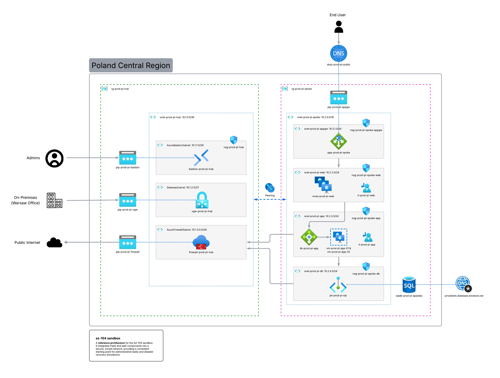

# azure-az104-sandbox
A ready-to-deploy lab environment designed to help you ace the AZ-104 certification exam.

## Why this project?
I built this infrastructure while preparing for **AZ-104** and learning **Terraform**, mainly to have a place to practice. Now I’m sharing it with the community.

This environment is a sandbox to run exercises, test configurations, and get comfortable with Azure administration in a hands-on way.

The goal is to practice various scenarius, which is helpfull during AZ-104 exam and in real life while working with Azure.

## Conceputal Diagram

## Tech Stack
* **Cloud:** Microsoft Azure
* **IaC:** Terraform
* **CLI:** Azure CLI & GitHub CLI

## Prerequisites

### 1. Azure Account
You’ll need an active Azure subscription to follow along. 
* **If you're a student:** Use the [Azure for Students](https://azure.microsoft.com/free/students/) offer. You get $100 in credits and some free services without even needing a credit card.
* **Otherwise:** Grab a [Free Trial account](https://azure.microsoft.com/free/) with $200 credit.

### 2. Terraform
You’ll also need the Terraform CLI to deploy the infrastructure. You can find the official, step-by-step installation guide for your OS here:

**Installation Guide:** [Install Terraform CLI](https://developer.hashicorp.com/terraform/tutorials/aws-get-started/install-cli)

Once installed, verify it by running:
`terraform -version` in CLI.

## Project Infrastructure

### Project Strategy
As I am based in Poland, the primary application infrastructure is hosted in the **Poland Central** region to ensure low latency and data residency compliance. The environment is designed using a modular approach, allowing for high availability through Availability Zones and secure connectivity.

You can easily change the deployment region in [variables](variables.tf) by changing location default value.

### Key Features
* **Networking:** Multi-subnet VNet architecture with restricted access.
* **Security:** Implementation of Azure Bastion, NSGs, and User-Defined Routes (UDR).
* **Compute:** High-availability VM deployments (VMSS and Availability Zones) with Load Balancers.
* **Governance:** Resource Locks and Tagging standards.

## Directory Structure
The repository is organized into reusable modules to keep the code clean, scalable, and compliant with DRY principles.

* **`modules/network/`**: A custom Terraform module responsible for provisioning Virtual Networks and dynamically generating subnets using the `for_each` loop.
* **`vnets.tf`**: The root configuration file where the network module is called to create both the Hub and the Spoke environments, along with their bidirectional VNet Peering.
* **`firewall.tf`**: Contains the deployment configuration for the central Azure Firewall (`AZFW_VNet` SKU) and its dedicated Public IP.
* **`variables.tf` & `outputs.tf`**: Define global variables (such as the default `Poland Central` location) and capture essential resource IDs for cross-referencing.

## How to Deploy
Follow these steps:

1. **Authenticate:** Log in to your Azure account via CLI.
   `az login`
2. **Initialize:** Download the required Terraform providers and initialize the working directory.
   `terraform init`
3. **Plan:** Preview the resources that will be created.
   `terraform plan`
4. **Apply:** Deploy the infrastructure to your Azure subscription (you will be prompted to type `yes`).
   `terraform apply`

**Note: Don't forget to run `terraform destroy` when you're done practicing to avoid unnecessary cloud charges!**

# Roadmap (Work in Progress)
This sandbox is continuously evolving. Here is the current implementation status:
* [x] Hub & Spoke VNet Architecture
* [x] VNet Peering with forwarded traffic enabled
* [x] Central Azure Firewall provisioning
* [ ] User-Defined Routes (UDR) to force Spoke traffic through the Hub Firewall
* [ ] Virtual Machines deployment in Availability Zones
* [ ] Secure remote access via Azure Bastion
* [ ] Managed PaaS Database configuration